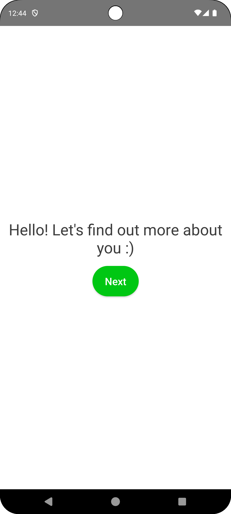
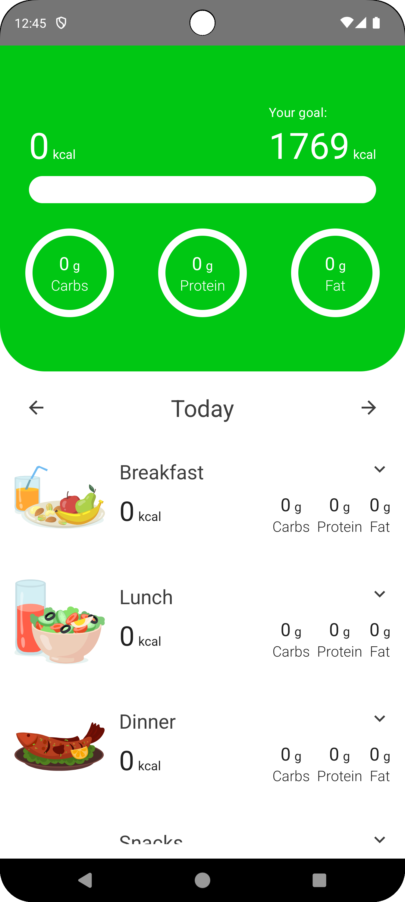
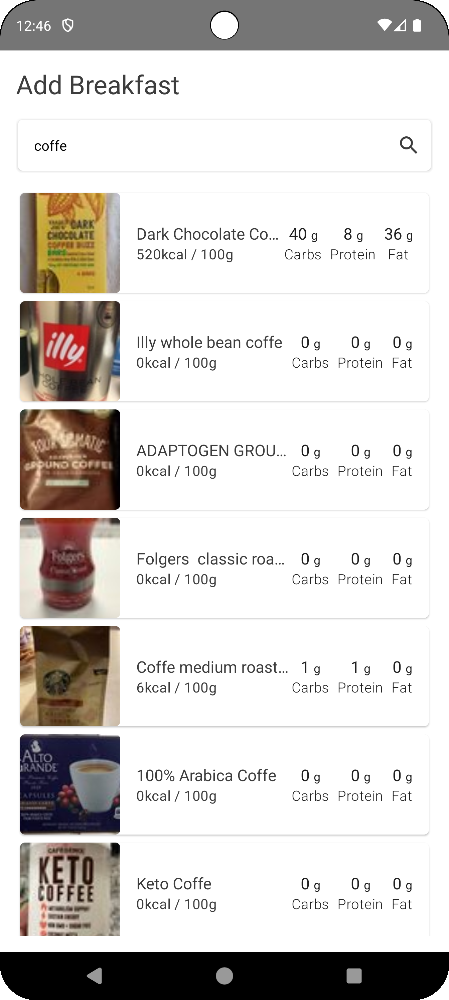
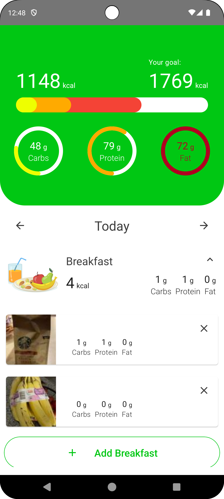

# 📱 Calorie Tracker App  

An Android application designed to help you achieve your weight goals, whether it's maintaining, losing fat, or gaining fat. 
With an intuitive interface and accurate calorie and macronutrient tracking, this app allows you to log your meals, set personalized goals, and visualize your progress in real-time.  

## ✨ Features  
✅ Easy food logging and calorie tracking  
✅ Custom goal settings (caloric deficit, maintenance, or surplus)  
✅ Macronutrient tracking (proteins, carbs, and fats)  
✅ Statistics and charts to monitor progress  

Take control of your nutrition and reach your goals! 💪🔥  

## Technologies Used

- Jetpack Compose  
- MVVM
- Multi module architecture
- Clean Code
- Dagger Hilt  
- Retrofit
- Shared preferences
- Room

## Screenshots

  
  
  
  

